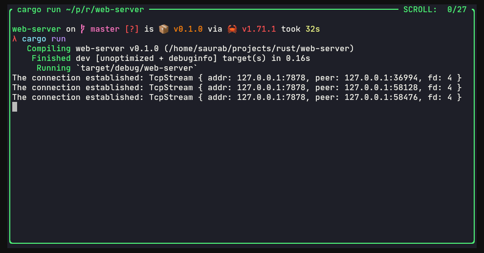

## 1. Listening to TCP connection

in console:
`cargo run`

loading `localhost:7878` in web browser shows an error message. However, we can get the message `Connection established ...` in console

Picture 1:

